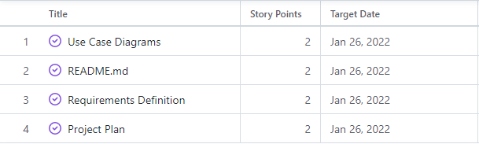
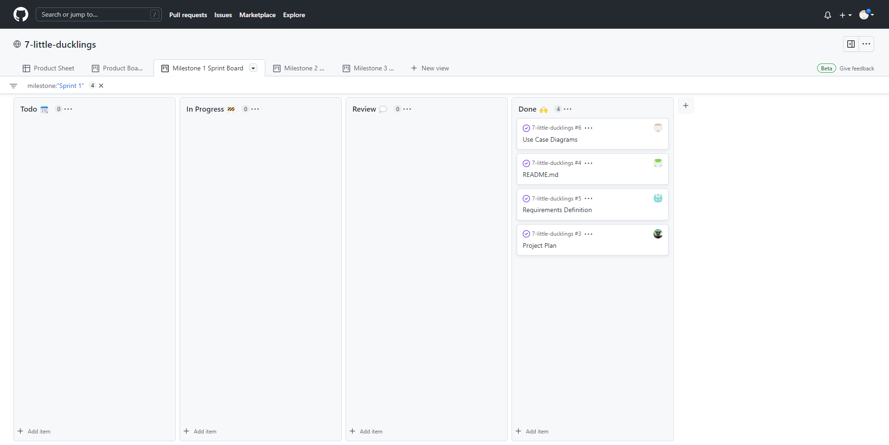

     
    
     
    

        <strong>Target End Date:</strong> January 26, 2022
         
        <strong>Scrum Master:</strong> Logan Ballard
    

     
    <h2>Metric to Evaluate During Sprint Retrospective</h2>
    
&lt;Insert Metric Here&gt;

     
     
    <h2>Stories and Time Estimates (Story Points)</h2>
    
     
    <table>
        <tr>
            <th>Story</th>
            <th>Acceptance Criteria</th>
        </tr>
        <tr>
            <td>Use Case Diagrams</td>
            <td>
                <ul>
                    <li>At least 8 use case diagrams</li>
                    <li>Give a clear overview of the functionality</li>
                </ul>
            </td>
        </tr>
        <tr>
            <td>README.md</td>
            <td>
                <h3>Contains the following:</h3>
                <ul>
                    <li>An explanation of the organization and name scheme for the workplace</li>
                    <li>Version-control procedures</li>
                    <li>Tool stack description and setup procedure</li>
                    <li>Build Instructions</li>
                    <li>Unit Testing Instructions</li>
                    <li>System Testing Instructions</li>
                     
                    As Needed:
                     
                    <li>Other development notes</li>
                </ul>
            </td>
        </tr>
        <tr>
            <td>Requirements Definition</td>
            <td>
                <h3>Contains the following:</h3>
                <ul>
                    <li>Introduction and Context</li>
                    <li>Users and their Goals</li>
                    <li>Functional Requirements</li>
                    <li>Non-functional Requirements</li>
                    <li>Future Features</li>
                    <li>Glossary</li>
                </ul>
            </td>
        </tr>
        <tr>
            <td>Project Plan</td>
            <td>
                <h3>Contains the following:</h3>
                <ul>
                    <li>A summary of the project</li>
                    <li>A description of team organization</li>
                    <li>A description of the overall development process</li>
                    <li>Policies, procedures, or tools for communication</li>
                    <li>Risk Analysis</li>
                </ul>
            </td>
        </tr>
    </table>
     
    <h2>Sprint Backlog</h2>
    
     
    

 
