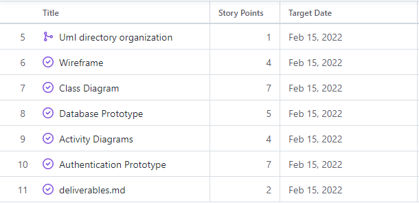
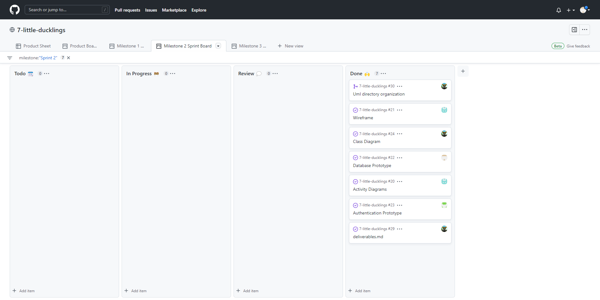

     
    
     
     
    

        <strong>Target End Date:</strong> February 15, 2022
         
        <strong>Scrum Master:</strong> Logan Ballard
    

     
    <h2>Metric to Evaluate During Sprint Retrospective</h2>
    
&lt;Insert Metric Here&gt;

     
     
    <h2>Stories and Time Estimates (Story Points)</h2>
    
     
    <table>
        <tr>
            <th>Story</th>
            <th>Tasks</th>
            <th>Acceptance Criteria</th>
        </tr>
        <tr>
            <td>Wireframe</td>
            <td>
                <ul>
                    <li>Form a more concrete idea of the application layout and functionality</li>
                    <li>Choose a general style for the wireframe</li>
                    <li>Create wireframe layout for each page</li>
                </ul>
            </td>
            <td>
                Demonstrates the general layout and UI of the application
            </td>
        </tr>
        <tr>
            <td>Class Diagrams</td>
            <td>
                <ul>
                    <li>Models class methods and members</li>
                    <li>Views class methods and members</li>
                    <li>Classes for any additional functionality</li>
                </ul>
            </td>
            <td>Accurately document the classes of objects in the system and their relationships with an appropriate level of specificity</td>
        </tr>
        <tr>
            <td>Database and Models Prototype</td>
            <td>
                <ul>
                    <li>Design Database Schema</li>
                    <li>Build Models Prototype classes</li>
                    <li>Create .pdf file of database schema</li>
                </ul>
            </td>
            <td>
                <ul>
                    <li>Functions properly</li>
                    <li>Models classes match UML class diagrams</li>
                </ul>
            </td>
        </tr>
        <tr>
            <td>Activity Diagrams</td>
            <td>
                <ul>
                    <li>Determine execution flow of application</li>
                    <li>Create activity diagrams for the various execution flows</li>
                </ul>
            </td>
            <td>Key execution flows are documented</td>
        </tr>
        <tr>
            <td>Authentication Prototype</td>
            <td></td>
            <td>Functions properly</td>
        </tr>
        <tr>
            <td>deliverables.md</td>
            <td>
                <ul>
                    <li>Revise README.md</li>
                    <li>Revise project plan</li>
                    <li>Revise requirements definition</li>
                    <li>Add any additional notes</li>
                </ul>
            </td>
            <td>
                All documents are up-to-date
            </td>
        </tr>
    </table>
     
    <h2>Sprint Backlog</h2>
    
     
    

